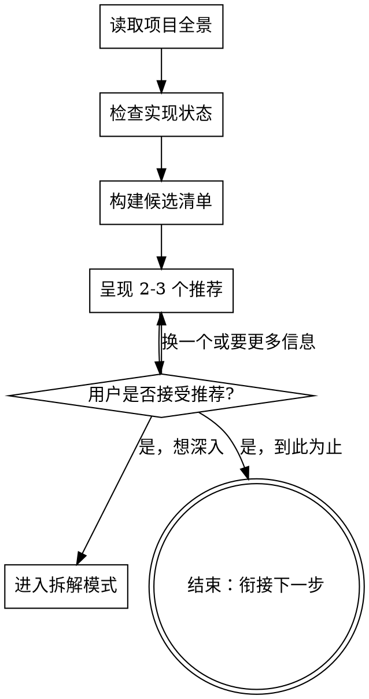
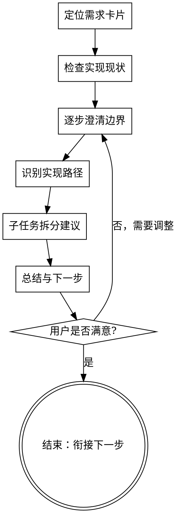

# 需求探索：优先排序与需求拆解

基于项目计划文档和代码实现现状，帮助用户快速做出"下一步做什么"或"这个需求怎么拆"的决策。

本命令是 OpenSpec 工作流的入口，探索完成后自然衔接到 `/opsx:pre-design` 或 `/opsx:new`。

**Input**: 可选参数。无参数进入排序模式；带参数（如 `/opsx:explore-req 大纲生成`）进入拆解模式。

两种模式：

- **排序模式**（无参数）：读取所有阶段文档 + 检查实现状态 → 推荐下一步做什么
- **拆解模式**（有参数）：针对指定需求 → 明确边界、成功标准、实现路径、子任务拆分

<HARD-GATE>
在需求探索过程中，不要生成或修改任何文档（包括需求卡片、设计文档、任务清单），不要编写代码，不要启动 OpenSpec change 或调用任何实现技能。本技能的唯一产出是对话文字。
</HARD-GATE>

## 模式识别

- 无参数调用（如 `/opsx:explore-req`）→ 进入排序模式
- 带参数调用（如 `/opsx:explore-req 大纲生成`）→ 进入拆解模式
- 参数无法匹配到已有需求 → 列出最接近的 2-3 个选项，让用户选择

## 排序模式：下一步做什么



### 步骤 1 — 读取项目全景

- 读取 `novel_docs/project_plan/项目规划路线图总览.md`，理解阶段依赖关系
- 读取每个阶段的 `阶段总览.md`，了解入口/出口条件
- 读取每个阶段的 `需求索引.md`，收集所有需求的状态、优先级和依赖

### 步骤 2 — 检查实现状态

- **优先**读取 `openspec/实现状态.md`，快速获取已知的实现状态
- 仅在 `openspec/实现状态.md` 不存在或信息明显不完整时，才扫描 `app/` 目录和 `openspec/changes/archive/`
- 如果发现 `openspec/实现状态.md` 与代码现状有不一致，向用户报告差异

### 步骤 3 — 构建候选清单

按以下优先级排序筛选候选：

1. **阶段顺序** — 靠前的阶段优先
2. **前置满足度** — 所有依赖已完成（或接近完成）的需求优先
3. **优先级** — P0 > P1 > P2
4. **解锁效果** — 完成后能解锁更多后续需求的优先

筛出 2-3 个最优候选。

### 步骤 4 — 呈现排序建议

对每个候选呈现：

- 需求名称 + 所属阶段
- 优先级
- 推荐理由（解锁了什么、前置条件的完成情况）
- 预估复杂度信号（基于需求卡片 Scope 段落）

明确推荐排名第一的候选，并解释为什么。

### 步骤 5 — 收敛到决策

用一个选择题问用户：

- 同意推荐，想对这个需求进入拆解模式
- 同意推荐，到此为止
- 想了解另一个候选的更多信息
- 有不同看法

最多 3 轮澄清。如果 3 轮后仍未收敛，总结已知信息和未决问题，结束。

### 结束后的衔接

当用户确认了要做的需求后，提示可用的下一步：

- 如果需求边界已清晰 → 建议 `/opsx:pre-design <需求名>` 或 `/opsx:new`
- 如果需求还需要拆解 → 建议先进入拆解模式深入分析

不自动调用这些命令，只告知用户可选的下一步。

## 拆解模式：深入理解单个需求



### 步骤 1 — 定位需求卡片

- 在各阶段 `需求索引.md` 中匹配用户指定的需求名称
- 读取完整的需求卡片（Goal、User Value、Success Criteria、Scope、Non-goals、Dependencies）
- 读取所属阶段的 `阶段总览.md` 获取阶段级上下文

### 步骤 2 — 检查实现现状

- 优先从 `openspec/实现状态.md` 查找该需求的状态
- 如需更多细节，检查 `app/` 中的相关代码和 `openspec/changes/` 中的 change
- 明确：已完成什么、还缺什么

### 步骤 3 — 逐步澄清边界

每次只问一个问题，优先选择题。按以下顺序推进：

1. **目标清晰度** — Goal 是否足够具体？有歧义吗？
2. **成功标准可验证性** — Success Criteria 是否可测试/可度量？
3. **范围边界** — Scope 是否有可能无限扩展的项？
4. **依赖就绪度** — Dependencies 是否真的已满足？
5. **与 Non-goals 的张力** — Scope 中是否有向 Non-goals 漂移的风险？

如果需求卡片已经足够清晰，可以跳过部分澄清直接进入下一步。

### 步骤 4 — 识别实现路径

基于需求 Scope 和现有代码模式，给出 2-3 个实现方向：

- 每个方向说明：涉及哪些现有 `app/` 模块、需要新建什么、预估规模（小/中/大）
- 推荐一个方向并给出理由

### 步骤 5 — 子任务拆分建议

将选定的实现路径拆分为有序子任务：

- 每个子任务足够小，可以作为一个独立的 OpenSpec change
- 每个子任务可独立测试
- 子任务之间有明确的先后顺序

呈现为编号列表，每条附简要描述。

### 步骤 6 — 总结与下一步

用简洁文字总结：

- 确认后的目标
- 精化后的成功标准（如有修改）
- 选定的实现路径
- 子任务拆分

提示可用的下一步：

- 对于第一个子任务 → `/opsx:pre-design` 进入需求梳理，或 `/opsx:new` 直接创建 change
- 如果需求本身需要先做 brainstorming → 建议 `/brainstorming`

不自动调用这些命令，只告知用户可选的下一步。

## 文档探索指引

```
实现状态：openspec/实现状态.md（OpenSpec 工作流状态索引，优先读取）

路线图入口：novel_docs/project_plan/项目规划路线图总览.md
阶段目录：novel_docs/project_plan/phases/{mvp,consistency,narrative,style,automation,saas}/
阶段总览：<phase>/阶段总览.md
需求索引：<phase>/需求索引.md
需求卡片：<phase>/requirements/<slug>.md

代码现状：app/ 目录（business/, capabilities/, interfaces/, shared/, bootstrap/）
已完成变更：openspec/changes/archive/
进行中变更：openspec/changes/（非 archive 子目录）
```

## 实现状态判断规则

| 条件 | 判定 |
|------|------|
| 有 archived change + 对应非空代码 | 已实现 |
| 有 archived change + 代码为空/占位 | 部分完成 |
| 有活跃 change（非 archive） | 进行中 |
| 索引状态"待进入 change"且无对应 change | 未开始 |
| 索引状态"待前置完成"但前置实际已完成 | 可开始 |

## 严格限制

- **只进行文字交流** — 不生成文件、不修改文档
- **不修改需求卡片** — 不更新 Status 字段、不编辑需求内容
- **不启动 OpenSpec change** — 不创建 proposal、design、tasks 或 specs
- **不编写代码** — 不写实现代码
- **不自动调用其他命令** — 结束时告知用户可用的下一步，但不代替执行
- **建议止步于对话** — 所有推荐仅作为对话文字，用户自行决定是否行动

## 核心原则

- **每次一个问题** — 不要一次抛出多个问题
- **优先选择题** — 选择题比开放题更容易推进
- **文档驱动** — 每个断言必须基于实际读取的项目文档，不能凭印象
- **代码验证** — 实现状态的判断必须检查实际文件，不能只看文档中的 Status 字段
- **收敛导向** — 目标是到达决策（选哪个需求，或怎么拆），不是广泛探索
- **最多 3 轮澄清** — 3 轮未收敛则总结已知和未决，结束
- **不重复 brainstorming** — 如果用户需要发散创意或模糊想法整理，引导到 `/brainstorming`
- **YAGNI** — 不建议超出需求卡片 Scope 的拆分或路径

## 反模式

**"这个需求我已经很了解了，直接推荐吧"**
即使是熟悉的需求，依赖关系和代码状态可能已经变化。每次都必须读取当前文档和检查代码。

**"先把所有需求都详细分析一遍"**
排序模式应该快速聚焦——读索引、查代码、给 2-3 个候选。不要在用户没要求时深入每一个需求卡片。

**"边分析边更新需求卡片状态"**
本技能不修改文档。发现的状态差异应作为观察报告给用户，不要直接修改。

**Guardrails**
- 本命令只产出对话文字，不修改任何文件
- 排序和拆解完成后提示工作流下一步，但不自动执行
- `openspec/实现状态.md` 是只读的——由 `/opsx:archive` 负责更新
