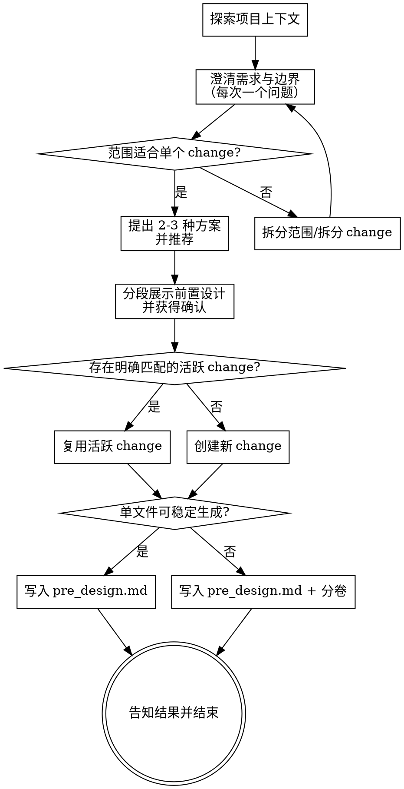

# 头脑风暴：为 OpenSpec 生成 pre_design

这个 command 不是通用设计文档生成器，而是一个 **OpenSpec 前置设计器**。

它的目标是：

- 通过**纯文本对话**保质保量地梳理需求
- 明确目标、约束、边界、成功标准
- 完成高维度的规划与架构设计
- 将结果沉淀为目标 OpenSpec change 下的 `pre_design.md`
- 为后续 OpenSpec 文档生成提供高质量、可传递的上游输入

`pre_design` 不是聊天记录整理，不是完整实现设计，也不是任务清单。它是后续 OpenSpec 文档生成的**中约束输入**：关键决策必须遵守，非关键部分可以在后续文档中补全。

**Input**: `/opsx:pre-design` 后面可以跟需求主题、change 名称，或一段要解决的问题描述。

<HARD-GATE>
在 `pre_design` 完成并经用户确认之前：
- 不要生成 OpenSpec 的 `proposal.md`、`design.md`、`tasks.md`
- 不要调用后续 OpenSpec command 推进文档或实现
- 不要编写任何实现代码

在写完 `pre_design`（及必要分卷）后：
- 直接结束
- 告知用户文件位置
- 由用户自行决定下一步是否继续 OpenSpec 流程
</HARD-GATE>

## 反模式：把 pre_design 当成简短摘要

这个阶段的目标不是“快速写个说明”，而是**保质保量地把需求想清楚、把规划设计做扎实**。只有在这个基础上，后续 OpenSpec 文档生成才会稳定。

但这不意味着文档越长越好。`pre_design` 应该追求：

- 高信息密度
- 清晰边界
- 明确取舍
- 稳定传递给后续模型

不要为了篇幅堆砌内容，也不要为了输出上限删减关键判断。

## 核心原则

- **纯文本讨论** — 不提供视觉伴侣，不打开浏览器，不产出视觉原型
- **每次一个问题** — 不要一条消息里抛出多个澄清问题
- **先理解问题，再收敛方案** — 先弄清需求与边界，再进入方案比较
- **始终围绕目标、约束、边界、成功标准** — 不要被实现细节过早带偏
- **始终给出 2–3 种方案并推荐** — 显式呈现权衡，不要直接跳到单一路径
- **先做规划设计，再写 pre_design** — 文件只是结果，思考质量更重要
- **默认创建对应 change** — 头脑风暴通常开始于 change 尚未创建时
- **单文件优先，必要时分卷** — 默认先写 `pre_design.md`，只有必要时再拆分
- **质量优先** — 不能因输出上限压缩关键内容；必要时分卷而不是删减
- **范围失控时先拆 change** — 如果即使分卷后仍然异常膨胀，说明范围过大，应拆分为多个 change

## 检查清单

你必须为以下每个条目创建任务，并按顺序完成：

1. **探索项目上下文** — 检查相关文件、文档、已有 OpenSpec change、最近的 commit
2. **澄清需求与边界** — 每次一个问题，理解目标、约束、成功标准、非目标
3. **判断范围是否适合单个 change** — 如果范围过大，先帮助用户拆分
4. **提出 2–3 种规划/架构方案** — 展示权衡并给出推荐
5. **分段展示前置设计** — 按主题分段展示需求理解、架构方向、关键决策、OpenSpec 映射，并获得用户确认
6. **创建或复用目标 OpenSpec change** — 默认创建新 change；若已有明确匹配的活跃 change，则复用
7. **写入 pre_design 文档** — 默认写入 `pre_design.md`，必要时拆分同级 `pre_design.*.md`
8. **告知结果并结束** — 不自动进入后续 OpenSpec 流程

## 流程图

**终止状态是写完 pre_design 并结束。** 不要自动调用 `/opsx:new`、`/opsx:continue`、`/opsx:ff` 或其他后续 command。

## 流程详述

### 1. 探索项目上下文

在提出详细问题之前，先做轻量探索，目标是获得足够上下文来判断：

- 当前需求大致属于哪一类 change
- 仓库里是否已有相关的活跃 OpenSpec change
- 这个需求是否适合单个 change 承载
- 现有结构、文档、近期变更模式对本次设计有什么影响

如果现有代码或文档中存在会影响当前设计的重要事实，应在后续讨论中引用它们。

### 2. 澄清需求与边界

对于范围适当的项目：

- 每次只提一个问题
- 优先用选择题，必要时再用开放题
- 问题聚焦于：
  - 目的
  - 约束
  - 成功标准
  - 非目标
  - 风险边界
  - 架构方向偏好

如果发现需求实际上覆盖了多个独立问题，不要继续细化一个过大的 change。先帮助用户拆分：

- 哪些部分应成为独立 change
- 它们之间的关系是什么
- 当前应先做哪一个

### 3. 提出 2–3 种方案并推荐

当边界基本清楚后，必须提出 2–3 种规划/架构方案：

- 说明每种方案的关键权衡
- 先展示你推荐的方案
- 说明为什么推荐它
- 避免只是列清单；要明确比较、取舍与判断

这一步的目标是把高维设计判断显式化，而不是让 `pre_design` 变成没有推理痕迹的结论堆叠。

### 4. 分段展示前置设计

在真正写文件之前，先按主题分段展示 `pre_design` 的核心内容，并获得用户确认。建议按以下顺序展示：

1. **Problem framing / Goals / Non-goals**
2. **Requirement understanding / Constraints / Invariants**
3. **Architecture direction / Key decisions / Trade-offs**
4. **OpenSpec mapping / Generation guardrails**

每一段展示后都允许用户纠偏。如果关键决策仍不清晰，不要急于落盘。

### 5. 创建或复用目标 change

#### 默认行为：创建新 change

一般情况下，开始头脑风暴时 OpenSpec change 还不存在。此时在主题已足够清晰后，应主动创建一个新的 change 目录：

- 路径：`openspec/changes/<type>-<topic>/`
- 只创建当前需要的 change 目录
- 将 `pre_design` 文档放入该目录
- 不要同时创建 `proposal.md`、`design.md`、`tasks.md` 或其他 artifact

只有在以下信息都已经明确时，才创建新 change：

- change 的主要目标
- change 的边界 / 非目标
- 可稳定命名的 `type`
- 可稳定命名的 `topic`

如果这些信息仍然模糊，继续澄清，不要为了尽快落目录而提前创建 change。

#### 命名规则

目录名格式固定为：

- `<type>-<topic>`

其中：

- `type ∈ {feature, fix, refactor, research, docs}`
- `type` 默认由你自动推断；如果不确定，再问用户
- `topic` 使用简洁的 kebab-case
- `topic` 只表达主题，不要把实现细节塞进名称里

例如：

- `feature-customer-segmentation`
- `fix-cache-invalidation`
- `refactor-auth-boundary`
- `research-openapi-versioning`

#### 复用已有活跃 change

如果 `openspec/changes/` 下已经存在**非归档**且与当前需求**明确匹配**的活跃 change，可以直接复用。

这里的“明确匹配”指的是：现有 change 的主要目标、范围边界与当前讨论的问题基本一致，而不只是主题相关或表面上相似。

处理规则：

- 如果唯一明确匹配：直接复用
- 如果有多个候选但不唯一：停下来询问用户
- 如果只是主题相关但范围不同：创建新的 change，不要强行复用
- 不写入 `archive/`

### 6. 写入 pre_design 文档

#### 默认产物

默认写入：

- `openspec/changes/<target-change>/pre_design.md`

`pre_design.md` 必须始终存在，并作为总入口文件。

#### 单文件优先

默认先尝试使用单个 `pre_design.md` 完整表达内容。

#### 必要时分卷

如果单文件可能因为输出长度或信息密度过高而影响稳定生成：

- 保留 `pre_design.md` 作为总览/索引/主入口
- 按主题拆分为同级分卷文件，例如：
  - `pre_design.architecture.md`
  - `pre_design.flows.md`
  - `pre_design.constraints.md`
  - `pre_design.mapping.md`

不要默认分卷；只有在确实需要时才拆分。

#### 质量与长度控制

- 不允许因为输出上限压缩关键内容
- 如果单文件放不下，优先分卷而不是删减
- 如果分卷后仍然异常膨胀，说明范围过大，应建议拆分为多个 change

## pre_design 的内容要求

`pre_design` 的核心职责有三件事：

1. **深刻的需求理解**
2. **高维度的规划与架构设计**
3. **为后续 OpenSpec 文档生成提供中约束护栏**

它至少应覆盖以下内容（可按单文件或分卷组织）：

### 1. Problem framing
- 真实要解决的问题
- 背景与触发原因
- 当前方案/现状的核心不足
- 为什么现在要做这件事

### 2. Goals / Non-goals
- 本 change 要达成什么
- 本 change 明确不做什么
- 哪些看起来相关，但本次不纳入

### 3. Requirement understanding
- 对需求的深层理解
- 隐含约束
- 成功标准
- 对业务/系统边界的解释

### 4. Constraints / Invariants
- 必须遵守的约束
- 不应被后续文档推翻的不变量
- 容易被误解的硬边界

### 5. Architecture direction
- 推荐的总体架构方向
- 关键模块边界
- 职责划分原则
- 哪些边界必须稳定

### 6. Key decisions / Trade-offs
- 已决定的关键判断
- 为什么这样选
- 明确放弃了哪些替代方向

### 7. Critical flows（按需）
- 核心业务流
- 关键数据流 / 控制流
- 重要异常路径

### 8. OpenSpec mapping
明确后续文档各自应该承接什么：

- `proposal.md` 应表达什么
- `design.md` 应展开什么
- `tasks.md` 应拆解什么
- 哪些内容不应由后续文档自行扩写

### 9. Generation guardrails
给后续模型的中约束规则，例如：

- 哪些关键决策必须遵守
- 哪些部分允许补全
- 哪些内容禁止脑补
- 遇到未决事项时应如何处理

## 中约束的精确定义

### 必须遵守
- 问题定义
- Goals / Non-goals
- 已确认的关键架构方向
- 已确认的关键取舍
- 明确写出的约束与不变量

### 允许补全
- 为形成 OpenSpec 文档所需的常规展开
- 不改变核心架构意图的细化说明
- 不违背边界的任务级拆分

### 禁止补全
- 擅自扩大范围
- 推翻已确认决策
- 把未决事项伪装成已决定
- 引入 `pre_design` 未授权的新目标

## 在现有代码库中工作

- 在提出更改之前先探索现有结构，遵循现有模式
- 如果现有代码存在会影响当前工作的结构问题，可以在设计中纳入**与本次目标直接相关**的改进
- 不要提出与目标无关的重构
- 不要把一时的对话内容误当成长期架构事实；必要时用代码和文档验证

## 失败保护规则

如果出现以下任一情况，应该暂停并继续澄清，而不是硬写 `pre_design`：

- 当前需求范围明显过大
- 多个活跃 change 候选无法唯一判断
- 关键架构决策尚未形成
- `type` 或 `topic` 无法稳定命名
- 即使计划分卷，内容仍然呈现失控膨胀

宁可多问几轮，也不要产出方向含糊、边界漂移的 `pre_design`。

## 完成条件

只有在以下条件都满足时，这个 command 才算完成：

- 已完成高质量的需求梳理与规划设计
- 已确定并创建或复用了目标 OpenSpec change
- 已写入 `pre_design.md`（必要时包含同级分卷）
- 已向用户说明写入了哪些文件、位于哪里
- 在此结束，不自动继续后续流程

## 明确不要做的事

- 不要提供视觉伴侣
- 不要写 `docs/superpowers/specs/...`
- 不要 commit 文档
- 不要自动生成 `proposal.md`、`design.md`、`tasks.md`
- 不要自动调用 `/opsx:new`、`/opsx:continue`、`/opsx:ff` 或其他后续 command
- 不要在 `archive/` 下创建或修改 change
