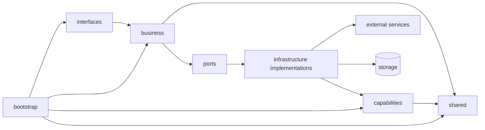

# 防腐层、调用链与依赖规则

- 来源文档：`docs/new_project_architecture_baseline_clean.md`
- 关联文档：`01-top-level-modules.md`、`02-business-internal-structure.md`

---

## 1. 本文件回答的问题

本文件用于回答以下问题：

- 这套架构中的“防腐层”到底如何落地；
- 为什么即便调用内部 `capabilities`，业务侧仍然需要自己的边界；
- 标准调用链是什么；
- 哪些依赖方向允许，哪些依赖方向禁止；
- 实现选择和横切技术策略应该放在哪里。

---

## 2. 防腐层的本质

在这套架构里，“防腐层”不是额外再加一层目录，而是通过以下组合形成：

- 业务定义的 `ports`；
- 节点内的 `infrastructure` 实现；
- `capabilities` 内部对外部世界的统一标准化。

核心含义是：

> 业务通过端口定义自己的语言，通过基础设施实现与外部世界发生关系。

因此，防腐层不是抽象口号，而是可以落在代码结构里的边界实现。

---

## 3. 两级隔离模型

### 第一级：`capabilities` 对外部世界的统一

当某类能力具有跨业务复用价值时，由 `capabilities` 负责：

- 屏蔽三方厂商差异；
- 统一请求与响应；
- 提供无业务语义的稳定接口。

### 第二级：业务节点对通用能力或外部依赖的适配

业务节点通过 `ports + infrastructure`：

- 将业务对象翻译为能力请求；
- 将能力结果翻译回业务对象；
- 隔离本地调用 / HTTP / RPC / MQ 等调用方式变化。

这意味着即使项目内部已经有统一能力组件，业务侧仍然需要自己的语言边界。

---

## 4. 为什么业务侧仍然需要防腐

即便调用的是本项目内部的 `capabilities`，业务侧仍然需要自己的边界，原因包括：

1. 业务语言与通用能力语言不同；
2. 调用方式未来可能变化；
3. 能力组件可能被独立拆分为服务；
4. 业务不应感知 transport 细节；
5. 不同节点对同一能力的语义理解不同。

因此，业务不应直接耦合到能力层暴露的接口形式，更不应直接耦合供应商字段、远程协议或 SDK 类型。

---

## 5. 标准调用链

### 通用调用链

```text
interfaces
  -> business.workflow / business.node
    -> service
      -> ports
        -> infrastructure implementations
          -> capabilities or external services
```

### 工作流型项目的推荐细化链路

```text
workflow graph
  -> node.py
    -> service.py
      -> ports.py
        -> infrastructure/*
          -> capabilities/*
          -> external systems
          -> repository/storage
```

### 核心约束

- `service.py` 不允许跳过 `ports` 直接依赖实现；
- `node.py` 不允许写具体外部调用逻辑；
- `interfaces` 不允许直接深入到 `infrastructure`；
- `workflow` 不允许直接依赖外部 SDK、远程 client 或具体存储实现。

---

## 6. 统一依赖方向

可接受的依赖方向如下：

```text
interfaces  -> business
business    -> ports
infrastructure -> capabilities / external systems / storage
capabilities -> shared
business    -> shared
bootstrap   -> all (for composition only)
```

可视化表达如下：



---

## 7. 禁止依赖清单

以下依赖关系应明确禁止：

- `capabilities -> business`
- `shared -> business`
- `interfaces -> infrastructure`，即跨过业务边界直接进入实现区
- `service.py -> concrete adapter`
- `workflow -> external service sdk`
- `business` 直接依赖供应商 SDK、HTTP client、ORM 具体实现

这些禁止项的目标是保护业务语言，防止实现细节向核心业务回流。

---

## 8. 实现选择与装配策略

所有实现选择都应优先在 `bootstrap/` 中完成，例如：

- 使用本地 capability 实现；
- 使用 HTTP client 实现；
- 使用 mock 实现；
- 使用本地 repository 或远端 repository。

原则是：

- 业务模块只感知接口，不感知实现来源；
- 实现切换不应渗透到业务用例层；
- 本地 / 远端 / mock / provider 切换应集中治理。

如果实现选择分散在业务代码中，会导致：

- 业务逻辑感知部署方式；
- 环境切换困难；
- 测试替换困难；
- 微服务拆分成本增大。

---

## 9. 横切策略放置原则

以下横切技术策略通常应优先落在 `shared/infra`、`capabilities/infrastructure` 或业务节点的 `infrastructure/` 中，而不应进入 `service.py`：

- 超时与重试；
- 幂等控制；
- 熔断与降级；
- 序列化与反序列化；
- 日志与链路追踪包装；
- 外部错误归一化；
- 远程调用鉴权与请求签名。

业务用例只描述“需要完成什么”，不应负责描述“调用技术细节如何处理”。

---

## 10. 判断某段调用是否越界的快速检查

当你看到一段调用链时，可以按下面的顺序快速检查：

1. 业务逻辑是否直接依赖具体实现，而不是依赖 `ports`；
2. 协议入口是否直接摸到了 `infrastructure`；
3. 工作流层是否混入了外部调用；
4. 共享层或能力层是否开始感知业务语义；
5. 实现切换逻辑是否散落进业务代码。

如果以上任意一项成立，通常就说明边界已经被破坏，需要回退到“业务定义语言、适配层负责翻译、装配层负责选择实现”的基本原则。
