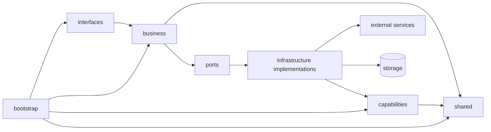

# 新项目架构基线文档（无业务逻辑版）

- 版本：v1.0
- 文档类型：架构基线 / 项目骨架规范
- 适用范围：基于工作流编排、可复用能力组件、可演进为微服务的后端项目
- 更新时间：2026-04-20

---

## 1. 文档目标

本文档定义一个**不包含任何业务逻辑**的新项目架构基线，用于指导项目初始化、目录搭建、模块划分、依赖方向、边界治理和后续演进。

本文档重点解决以下问题：

1. **边界如何定义**：业务模块、通用能力、外部接口、共享组件、启动装配分别负责什么。
2. **依赖如何约束**：哪些模块可以依赖哪些模块，哪些依赖是禁止的。
3. **防腐层如何落地**：如何通过 `ports + infrastructure` 形成稳定的边界。
4. **如何支持演进**：当前以单体项目形态落地，后续可平滑演进为独立服务或微服务。
5. **如何避免结构腐化**：如何防止 `shared`、`capabilities`、工作流状态与边界适配逐步失控。

本文档不讨论具体业务领域、业务流程细节、领域规则实现，也不绑定任何单一厂商或三方服务。

---

## 2. 架构目标

该架构基线需要满足以下目标：

- **边界清晰**：业务语义、通用能力、外部协议、共享基础设施互不混淆。
- **结构轻量**：前期不强制重型分层，避免过度设计。
- **依赖可控**：通过显式端口和适配实现约束调用方向。
- **可替换**：调用方式可从本地方法调用平滑切换为 HTTP / RPC / MQ。
- **可复用**：真正通用的能力沉淀到 `capabilities`，避免业务逻辑下沉污染。
- **可演进**：节点内部结构允许从平铺模式逐步演进到更细粒度分层。
- **可测试**：业务模块依赖抽象端口，便于单元测试与替身替换。
- **可治理**：通过准入规则与架构约束，降低后期目录腐化与隐式耦合风险。

---

## 3. 核心设计原则

### 3.1 业务优先，技术从属
目录结构优先表达业务边界和系统边界，而不是优先表达技术类型。

### 3.2 先平铺，后演进
节点内部前期采用轻量平铺结构，通过文件职责进行区分；只有当复杂度显著上升时，才继续拆分更细粒度层次。

### 3.3 通用能力必须无业务语义
`capabilities` 中只允许放置跨业务复用、输入输出已规范化、且**不带业务属性**的通用能力。

### 3.4 业务必须拥有自己的依赖边界
业务模块不直接依赖具体调用方式。业务通过 `ports` 定义所需能力，再由 `infrastructure` 提供实现，以达到防腐、隔离和可替换目的。

### 3.5 防腐层不是单独的“概念层”，而是“边界实现”
防腐层通过**业务侧 `ports + infrastructure`** 实现：
- `ports` 定义业务语言中的接口；
- `infrastructure` 负责将内部业务语言翻译为外部世界或通用能力的调用。

### 3.6 共享模块必须克制
`shared` 只承载稳定、通用、低业务语义的内核与基础设施能力，不允许成为“万能杂物间”。

### 3.7 面向未来部署形态变化设计
今天某个能力可能是本地类调用，未来可能被拆成独立服务。业务侧不应感知这种变化。

### 3.8 准入比归档更重要
一个模块“能否进入某层”，比“代码最终放在哪个目录”更重要。凡是不满足该层语义边界的内容，即使临时方便，也不应放入对应目录。

### 3.9 边界必须可执行
边界不是文档口号，必须能够通过命名约束、依赖检查、测试替身、装配规则和代码审查持续守护。

---

## 4. 顶层架构总览

推荐目录如下：

```text
project_scaffold/
├─ app/
│  ├─ business/
│  │  ├─ domain_a/
│  │  │  ├─ workflow/
│  │  │  │  ├─ graph.py
│  │  │  │  ├─ state.py
│  │  │  │  ├─ registry.py
│  │  │  │  └─ edges.py
│  │  │  ├─ domain_services/
│  │  │  └─ nodes/
│  │  │     ├─ unit_x/
│  │  │     │  ├─ node.py
│  │  │     │  ├─ service.py
│  │  │     │  ├─ dto.py
│  │  │     │  ├─ entities.py
│  │  │     │  ├─ rules.py
│  │  │     │  ├─ ports.py
│  │  │     │  └─ infrastructure/
│  │  │     │     ├─ capability_adapter.py
│  │  │     │     ├─ external_service.py
│  │  │     │     └─ repository.py
│  │  │     └─ unit_y/
│  │  │        ├─ node.py
│  │  │        ├─ service.py
│  │  │        ├─ dto.py
│  │  │        ├─ entities.py
│  │  │        ├─ rules.py
│  │  │        ├─ ports.py
│  │  │        └─ infrastructure/
│  │  │           ├─ capability_adapter.py
│  │  │           └─ repository.py
│  │  └─ domain_b/
│  │     ├─ workflow/
│  │     ├─ domain_services/
│  │     └─ nodes/
│  ├─ capabilities/
│  │  ├─ capability_x/
│  │  │  ├─ contracts.py
│  │  │  ├─ dto.py
│  │  │  ├─ service.py
│  │  │  └─ infrastructure/
│  │  │     ├─ provider_a.py
│  │  │     └─ provider_b.py
│  │  └─ capability_y/
│  │     ├─ contracts.py
│  │     ├─ dto.py
│  │     ├─ service.py
│  │     └─ infrastructure/
│  ├─ interfaces/
│  │  └─ http/
│  ├─ shared/
│  │  ├─ kernel/
│  │  ├─ infra/
│  │  └─ events/
│  └─ bootstrap/
```

说明：
- `domain_services/` 为**可选目录**，仅用于承载同一业务域内多个节点共享、但不具备跨业务复用价值的领域级逻辑。
- 前期若尚不存在此类内容，可不创建；只有出现明确复用需求时再引入。

---

## 5. 顶层模块职责与边界

## 5.1 `business/`
`business` 是系统中唯一允许承载**业务语义**的主区域。

### 职责
- 定义业务工作流。
- 组织业务节点。
- 定义业务对象、业务规则、业务用例。
- 定义业务需要的能力端口（`ports`）。
- 通过 `infrastructure` 实现对外部世界和通用能力的适配。
- 在业务域内部沉淀有限范围的共享业务能力。

### 不负责
- 三方 SDK 直接暴露给其他模块。
- 通用能力的跨业务抽象沉淀。
- 协议层入口处理（HTTP、消息订阅等）。
- 系统级启动装配。

### 边界规则
- `business` 可以依赖：
  - `shared`
  - 自身业务模块内部的 `ports` / `infrastructure`
  - 通过业务侧 `infrastructure` 间接对接 `capabilities`
- `business` 不允许被 `shared` 反向依赖。
- `business` 之间不得通过实现细节相互耦合，应通过显式接口或更高层编排协作。
- `business` 中的 `service.py`、`rules.py`、`entities.py` 不得直接依赖 `capabilities` 的具体实现。

### 说明
“`business` 可以使用 `capabilities`”不等价于“业务实现可以直接调用 capability 具体实现”。
业务对通用能力的接入应始终经过：

```text
service.py -> ports.py -> infrastructure/* -> capabilities/*
```

这样才能保证业务语言稳定，不被能力层接口、供应商字段或调用协议直接污染。

---

## 5.2 `capabilities/`
`capabilities` 用于承载**跨业务复用的通用能力组件**。

### 职责
- 对外提供无业务语义的标准能力接口。
- 屏蔽第三方服务或底层实现差异。
- 统一输入输出模型。
- 允许未来独立部署或微服务化。

### 典型能力形态
- 文本生成
- 检索查询
- 内容抓取
- 文件解析
- 通用审核
- 统一通知通道

### 约束
- 不允许内嵌具体业务语义。
- 不允许以“通用组件”名义下沉业务规则。
- 不允许暴露供应商特定字段给业务层。
- 对外接口必须标准化。

### 边界规则
- `capabilities` 可以依赖：
  - `shared`
  - 自身内部 `infrastructure`
- `capabilities` 不允许依赖：
  - `business`
  - `interfaces`
  - `bootstrap`

### 设计要求
如果某能力尚未满足“跨业务复用 + 无业务语义 + 输入输出可规范化”，则不应提前沉淀进 `capabilities`，可暂时保留在具体业务模块侧。

### 准入标准
进入 `capabilities` 的内容应尽量同时满足以下条件：
- 存在明确的跨业务复用需求，而不是单一业务内偶发复用；
- 能力命名可采用中性语言表达，而不是业务语义命名；
- 输入输出模型可以在能力层完成统一标准化；
- 外部供应商差异可以在能力内部完成吸收；
- 即使未来独立部署，也不会要求业务侧大规模改写语义接口。

凡是不满足以上条件的实现，优先保留在具体业务域内，不应为了“看起来更通用”而提前平台化。

---

## 5.3 `interfaces/`
`interfaces` 用于承载所有外部协议入口。

### 职责
- 接收外部请求。
- 做协议层数据解析与响应组装。
- 进行鉴权、路由、协议映射、状态码转换等边界处理。
- 调用 `business` 暴露的应用入口。

### 不负责
- 业务规则判断。
- 业务对象持久化。
- 工作流编排细节。
- 外部依赖适配。

### 边界规则
- `interfaces` 可以依赖：
  - `business`
  - `shared`
- `interfaces` 不应直接依赖具体三方 SDK。
- `interfaces` 不应绕开业务入口直接调节点实现。
- `interfaces` 不应跨过业务边界直接进入 `business/**/infrastructure/*`。

---

## 5.4 `shared/`
`shared` 用于沉淀**稳定、低业务语义、跨上下文可共用**的基础模块。

### 职责
- 通用基础类型与内核对象。
- 通用异常基类、结果类型、标识符、时间、配置抽象。
- 事件基类与系统级事件基础设施。
- 与具体业务无关的基础设施组件。

### 子目录建议

#### `shared/kernel/`
放稳定的通用内核构件，例如：
- `Result`
- `DomainError`
- `Identifier`
- `Clock`
- `Pagination`
- 通用值对象基类

#### `shared/infra/`
放系统级基础设施抽象或实现，例如：
- 数据库连接管理
- HTTP 客户端封装
- 配置加载
- 日志/链路追踪封装
- 序列化基础设施
- 重试、超时、熔断等通用调用策略封装

#### `shared/events/`
放事件相关基础设施，例如：
- 事件基类
- 事件发布器接口
- 事件总线基础实现
- Outbox 等公共机制

### 严格禁止
- 任何带明显业务语义的对象进入 `shared`
- 把“目前没地方放”的代码随手塞进 `shared`
- 通过 `shared` 建立隐式跨业务耦合
- 将业务 DTO、业务枚举、业务规则以“基础组件”名义沉入 `shared`

### 准入标准
只有满足以下特征的内容才适合进入 `shared`：
- 与具体业务域无关；
- 可被多个上下文稳定复用；
- 生命周期预期较长，不因单一业务变化频繁波动；
- 抽象后不会反向要求业务语义向它妥协。

---

## 5.5 `bootstrap/`
`bootstrap` 负责系统装配与启动。

### 职责
- 依赖注入容器搭建。
- 运行时配置装配。
- 实现选择（本地 / HTTP / Mock / 第三方）。
- 应用启动入口初始化。

### 不负责
- 业务逻辑。
- 业务规则。
- 协议处理细节。
- 通用能力实现细节本身。

### 边界规则
- `bootstrap` 可依赖全项目各模块用于装配。
- 其他模块不应反向依赖 `bootstrap`。
- 任何运行时实现切换应优先在 `bootstrap` 完成，而非侵入业务逻辑。

---

## 6. `business` 内部标准结构

每个业务节点采用以下轻量结构：

```text
unit_x/
├─ node.py
├─ service.py
├─ dto.py
├─ entities.py
├─ rules.py
├─ ports.py
└─ infrastructure/
   ├─ capability_adapter.py
   ├─ external_service.py
   └─ repository.py
```

该结构不要求所有文件都必须存在，但职责边界必须保持一致。

对于同一业务域内、多个节点共享但不具备跨业务复用价值的逻辑，可在业务域下补充：

```text
domain_a/
├─ workflow/
├─ domain_services/
└─ nodes/
```

### `domain_services/` 的适用范围
- 同一业务域内多个节点共用的领域级策略与组装逻辑；
- 领域级工厂、策略集合、校验器组合；
- 只在当前业务域内有意义、不适合进入 `shared` 或 `capabilities` 的组件。

### 不适合放入 `domain_services/` 的内容
- 纯通用能力，应进入 `capabilities`；
- 全局基础设施，应进入 `shared`；
- 单个节点私有逻辑，应留在节点内部；
- 对外部系统的直接适配，应优先放在节点内 `infrastructure/`。

---

## 7. 节点内部文件职责

## 7.1 `node.py`
### 职责
- 作为工作流节点入口。
- 接收工作流状态或上游输入。
- 将输入转换为节点所需命令对象。
- 调用 `service.py`。
- 将结果映射回工作流状态。

### 不负责
- 业务规则判断。
- 外部服务调用细节。
- 数据持久化细节。

### 说明
`node.py` 是工作流编排和节点业务之间的第一层边界。  
它是节点入口适配器，而非业务实现层。

---

## 7.2 `service.py`
### 职责
- 实现节点级业务用例编排。
- 调度业务规则、业务对象、端口调用。
- 串联“读取、处理、生成、保存”等步骤。
- 组织节点内多个依赖之间的协作。

### 不负责
- 第三方协议处理。
- 具体 SDK / HTTP / RPC 调用。
- 底层持久化实现。

### 要求
- `service.py` 必须只依赖 `ports` 中定义的抽象，而不是依赖具体实现。
- `service.py` 内使用的语言应尽量是**业务语言**，而不是 capability 语言或供应商语言。
- `service.py` 不应直接感知调用方式差异、本地或远端部署差异、重试与超时等实现策略。

---

## 7.3 `dto.py`
### 职责
- 定义节点输入输出数据结构。
- 定义命令对象、查询对象、响应对象。
- 承载跨文件协作所需的数据载体。

### 不负责
- 业务规则。
- 领域行为。
- 外部协议适配。

---

## 7.4 `entities.py`
### 职责
- 定义节点内部的核心业务对象。
- 表达业务状态、业务约束承载对象和关键概念。

### 不负责
- 外部接口模型。
- 三方返回结构。
- 基础设施实现。

---

## 7.5 `rules.py`
### 职责
- 定义可复用的业务规则。
- 集中表达校验、约束、判定逻辑。

### 不负责
- 外部依赖调用。
- 工作流编排。
- 持久化。

---

## 7.6 `ports.py`
`ports.py` 是业务侧的抽象边界。

### 职责
- 定义业务所需能力的接口。
- 定义仓储接口、外部服务端口、共享能力端口。
- 屏蔽调用方式与实现位置差异。

### 关键原则
- `ports` 必须由业务定义，而不是由基础设施定义。
- `ports` 应使用业务语言表达需求，不应直接照搬通用组件接口。
- `ports` 是内聚在节点或业务模块内部的，不是全局随意共享的接口仓库。

### 示例思路
应定义为“业务需要什么”，而不是“底层系统能做什么”。

推荐表达方式：
- `TextComposer`
- `ContextReader`
- `ArtifactRepository`

不推荐表达方式：
- `HttpClientPort`
- `GenerateTextPort`
- `SearchApiPort`

后者更接近技术实现语言，不利于防腐。

---

## 7.7 `infrastructure/`
`infrastructure` 是节点内的**适配实现区**，用于实现 `ports.py` 中定义的接口。

### 职责
- 适配 `capabilities`
- 适配第三方外部服务
- 适配数据库 / 文件 / 存储
- 做调用协议转换、异常归一化、数据结构映射
- 承担调用层面的技术策略整合，例如超时、重试、幂等、序列化与错误翻译

### 不负责
- 业务规则
- 业务流程编排
- 业务对象设计

### 说明
`infrastructure` 在节点内部承担防腐职责：
- 将业务语言翻译为 capability 语言；
- 将 capability 语言翻译为业务语言；
- 将外部协议差异隔离在边界内部。

### 推荐实现类型
- `capability_adapter.py`：适配内部通用组件
- `external_service.py`：适配外部专用依赖
- `repository.py`：适配持久化能力

---

## 8. 防腐层设计

## 8.1 防腐层的本质
本架构中，“防腐层”不是单独再加一层目录，而是通过以下组合形成：

- 业务定义的 `ports`
- 节点内的 `infrastructure` 实现
- `capabilities` 内部对外部世界的统一标准化

即：

> **业务通过端口定义自己的语言，通过基础设施实现与外部世界发生关系。**

---

## 8.2 两级隔离模型

### 第一级：`capabilities` 对外部世界的统一
当某类能力具有跨业务复用价值时，由 `capabilities` 负责：
- 屏蔽三方厂商差异；
- 统一请求与响应；
- 提供无业务语义的稳定接口。

### 第二级：业务节点对通用能力或外部依赖的适配
业务节点通过 `ports + infrastructure`：
- 将业务对象翻译为能力请求；
- 将能力结果翻译回业务对象；
- 隔离“本地调用 / HTTP / RPC / MQ”等调用方式变化。

---

## 8.3 为什么业务侧仍然需要防腐
即便调用的是本项目内部的 `capabilities`，业务侧仍然需要自己的边界，原因包括：

1. **业务语言与通用能力语言不同**
2. **调用方式未来可能变化**
3. **能力组件可能被独立拆分为服务**
4. **业务不应感知 transport 细节**
5. **不同节点对同一能力的语义理解不同**

---

## 9. 调用链路规范

推荐调用链路如下：

```text
interfaces
  -> business.workflow / business.node
    -> service
      -> ports
        -> infrastructure implementations
          -> capabilities or external services
```

对于工作流型项目，推荐链路更细化为：

```text
workflow graph
  -> node.py
    -> service.py
      -> ports.py
        -> infrastructure/*
          -> capabilities/*
          -> external systems
          -> repository/storage
```

### 约束
- `service.py` 不允许跳过 `ports` 直接依赖实现。
- `node.py` 不允许写具体外部调用逻辑。
- `interfaces` 不允许直接深入到 `infrastructure`。
- `workflow` 不允许直接依赖外部 SDK、远程 client 或具体存储实现。

---

## 10. 工作流边界定义

## 10.1 `workflow/` 的职责
`workflow/` 负责整体流程编排，而不是业务细节实现。

推荐结构：

```text
workflow/
├─ graph.py
├─ state.py
├─ registry.py
└─ edges.py
```

### `graph.py`
负责图结构定义和流程装配。

### `state.py`
定义工作流状态结构。

### `registry.py`
维护节点注册和节点映射。

### `edges.py`
定义节点间跳转条件、路由和状态迁移规则。

---

## 10.2 工作流与节点的边界
### 工作流负责
- 节点如何连接
- 状态如何流转
- 哪些条件触发下一步
- 流程拓扑

### 节点负责
- 单个步骤内部的业务用例实现
- 步骤级读写处理
- 本步骤依赖的端口调用

### 严格禁止
- 节点内部决定主流程拓扑
- 工作流层写入具体业务规则细节
- 在图结构中混入大量外部调用代码

---

## 10.3 工作流状态边界
工作流状态通常是一个跨节点共享的数据结构，天然容易膨胀。

### 约束
- 不允许将原始大字典一路穿透到业务逻辑内部。
- `node.py` 负责将状态转换为 `dto` 或命令对象。
- 节点内部应尽量只处理清晰的业务对象，而不是直接操作全局状态。

### 治理原则
- `state.py` 只保留跨节点共享所必需的最小状态；
- 中间计算结果优先在节点内部封装，不应无边界回灌到全局状态；
- 工作流状态应区分流程控制字段、业务上下文字段、追踪审计字段；
- 新增状态字段时应优先确认其是否确实需要跨节点共享。

### 不推荐做法
- 将所有上游上下文与下游中间产物统一塞入一个无限扩展的状态对象；
- 节点直接修改全局状态中与自身职责无关的字段；
- 用“状态字段是否存在”代替清晰的节点输入输出契约。

---

## 11. `capabilities` 标准结构

推荐结构：

```text
capability_x/
├─ contracts.py
├─ dto.py
├─ service.py
└─ infrastructure/
   ├─ provider_a.py
   └─ provider_b.py
```

### `contracts.py`
定义对外暴露的稳定能力协议。

### `dto.py`
定义标准化输入输出。

### `service.py`
提供统一门面，对上层暴露单一调用入口。

### `infrastructure/`
对接不同厂商、协议、第三方实现。

### 原则
- `capabilities` 面向“能力”抽象，不面向“业务”抽象。
- 不允许出现业务命名，例如“生成章节”“生成人物设定”这类接口命名。
- 必须使用中性、稳定、可复用的能力表达。
- 能力层内部可以感知供应商差异，但这种差异不应向业务层泄露。

---

## 12. 依赖方向规则

统一依赖方向如下：

```text
interfaces  -> business
business    -> ports
infrastructure -> capabilities / external systems / storage
capabilities -> shared
business    -> shared
bootstrap   -> all (for composition only)
```

更准确地说：



### 禁止依赖
- `capabilities -> business`
- `shared -> business`
- `interfaces -> infrastructure`（跨过业务边界）
- `service.py -> concrete adapter`
- `workflow -> external service sdk`
- `business` 直接依赖供应商 SDK、HTTP client、ORM 具体实现

### 实施原则
依赖规则不仅是编码约定，也应通过自动化手段校验，例如架构测试、依赖扫描、import 约束与 CI 审查。

---

## 13. 架构治理与边界守护

## 13.1 守护目标
该基线不是一次性目录模板，而是长期治理规则。需要重点防止以下腐化趋势：

- `shared` 逐步演化为杂物间；
- `capabilities` 逐步演化为伪共享业务层；
- `service.py` 逐步绕过 `ports` 直接调用实现；
- `workflow state` 逐步演化为无边界全局上下文；
- 运行时实现选择逐步回流到业务代码内部。

## 13.2 推荐守护手段
- 通过 import 规则限制模块依赖方向；
- 通过架构测试校验 `service.py` 不得直接依赖 SDK / ORM / HTTP client；
- 通过代码审查检查新增代码是否误入 `shared` 或 `capabilities`；
- 通过模块 owner 或责任人机制守护共享层与能力层边界；
- 通过统一装配与测试替身校验接口隔离是否仍然有效。

## 13.3 评审重点
新增模块或新代码进入以下区域时，应重点评审：
- `shared/`
- `capabilities/`
- `workflow/state.py`
- `business/**/ports.py`
- `business/**/infrastructure/*`

这些区域是边界能力与架构演进的高敏感区，进入门槛应高于普通业务实现文件。

---

## 14. 实现选择与装配策略

## 14.1 装配位置
所有实现选择都在 `bootstrap/` 中完成，例如：

- 使用本地 capability 实现
- 使用 HTTP client 实现
- 使用 mock 实现
- 使用本地 repository 或远端 repository

### 原则
业务模块只感知接口，不感知实现来源。

---

## 14.2 为什么必须集中装配
如果实现选择分散在业务代码中，会导致：

- 业务逻辑感知部署方式
- 环境切换困难
- 测试替换困难
- 微服务拆分成本增大

---

## 14.3 横切策略放置原则
以下横切策略通常应优先落在 `shared/infra`、`capabilities/infrastructure` 或业务节点的 `infrastructure/` 中，而不应进入 `service.py`：

- 超时与重试
- 幂等控制
- 熔断与降级
- 序列化与反序列化
- 日志与链路追踪包装
- 外部错误归一化
- 远程调用鉴权与请求签名

业务用例只描述“需要完成什么”，不应负责描述“调用技术细节如何处理”。

---

## 15. 微服务演进策略

本架构默认支持以下演进路径：

### 阶段 1：单体内部模块化
- `capabilities` 以本地模块形态存在
- 业务通过 `ports + infrastructure` 调用本地能力

### 阶段 2：能力独立部署
- 将某个 `capability` 拆分为独立服务
- 业务侧仅替换 `infrastructure` 实现
- `ports` 与 `service.py` 不变

### 阶段 3：跨进程通信增强
- 从本地方法调用演进为 HTTP / RPC / MQ
- 由 `infrastructure` 处理序列化、鉴权、重试、超时等问题

### 阶段 4：按业务边界继续拆分
- 如果业务域进一步膨胀，可继续按业务域拆分服务
- 当前节点结构与端口边界仍可保留

### 关键前提
只有当业务侧对依赖已经完成抽象隔离时，这种演进才会低成本。

---

## 16. 命名规范

### 16.1 目录命名
- 业务目录采用业务能力或业务单元命名。
- 通用能力目录采用中性能力命名。
- 避免使用 `utils`, `common2`, `misc`, `temp` 之类模糊名称。

### 16.2 端口命名
端口命名必须表达**业务所需能力**，而不是技术手段。

推荐：
- `ContextReader`
- `ContentWriter`
- `ArtifactRepository`

不推荐：
- `HttpPort`
- `OpenAIAdapterPort`
- `SDKGateway`

### 16.3 基础设施实现命名
实现类名应表达“如何接入某类依赖”，例如：
- `LocalCapabilityContextReader`
- `HttpCapabilityContextReader`
- `SqlArtifactRepository`
- `ExternalValidationClient`

---

## 17. 测试策略

## 17.1 单元测试
重点测试：
- `service.py`
- `rules.py`
- `entities.py`

测试方式：
- 通过 `ports` 替身注入 fake / stub / mock
- 不依赖真实三方服务
- 不依赖真实网络

## 17.2 集成测试
重点测试：
- `infrastructure/`
- `capabilities/infrastructure/`
- `interfaces/`

验证内容：
- 协议映射正确性
- 外部依赖连接稳定性
- 数据映射与异常转换是否符合预期
- 横切策略是否符合预期，例如重试、超时、鉴权、错误翻译

## 17.3 端到端测试
从 `interfaces` 入口验证完整调用链。

## 17.4 架构测试
建议补充面向结构约束的自动化测试，例如：
- 禁止 `service.py` 直接 import 供应商 SDK；
- 禁止 `interfaces` 直接依赖业务侧 `infrastructure`；
- 禁止 `capabilities` 依赖 `business`；
- 禁止 `shared` 引入业务语义模块；
- 检查业务调用是否遵循 `service -> ports -> infrastructure` 链路。

---

## 18. 反模式与禁止事项

### 18.1 禁止把 `capabilities` 做成“伪共享业务层”
凡是带明显业务语义、只服务单一业务、没有复用价值的代码，不得提前进入 `capabilities`。

### 18.2 禁止业务逻辑下沉到 `infrastructure`
`infrastructure` 只做适配，不做业务决策。

### 18.3 禁止 `service.py` 直接调用 SDK / HTTP / ORM
这会破坏业务边界，导致后期替换成本陡增。

### 18.4 禁止通过 `shared` 传播业务耦合
`shared` 不能成为跨模块偷懒依赖的通道。

### 18.5 禁止工作流层承载业务实现
工作流只负责编排，不负责业务规则和外部依赖细节。

### 18.6 禁止为所有模块强制重型分层
保持轻量结构，按复杂度演进，而不是按理想模型预先堆叠层次。

### 18.7 禁止把工作流状态当成隐式万能上下文
不能用不断扩张的全局状态替代清晰的节点边界与输入输出契约。

### 18.8 禁止在业务代码中分散做实现选择
本地 / 远端 / mock / provider 切换应集中在 `bootstrap` 或边界适配区，不应渗透到业务用例。

---

## 19. 推荐初始化骨架

```text
project_scaffold/
├─ app/
│  ├─ business/
│  │  └─ domain_a/
│  │     ├─ workflow/
│  │     │  ├─ graph.py
│  │     │  ├─ state.py
│  │     │  ├─ registry.py
│  │     │  └─ edges.py
│  │     ├─ domain_services/
│  │     └─ nodes/
│  │        └─ unit_x/
│  │           ├─ node.py
│  │           ├─ service.py
│  │           ├─ dto.py
│  │           ├─ entities.py
│  │           ├─ rules.py
│  │           ├─ ports.py
│  │           └─ infrastructure/
│  │              ├─ capability_adapter.py
│  │              ├─ external_service.py
│  │              └─ repository.py
│  ├─ capabilities/
│  │  └─ capability_x/
│  │     ├─ contracts.py
│  │     ├─ dto.py
│  │     ├─ service.py
│  │     └─ infrastructure/
│  │        └─ provider_a.py
│  ├─ interfaces/
│  │  └─ http/
│  ├─ shared/
│  │  ├─ kernel/
│  │  ├─ infra/
│  │  └─ events/
│  └─ bootstrap/
```

该骨架具备以下特征：
- 顶层边界清晰；
- 节点内部轻量但有明确防腐能力；
- 能力组件可复用且可独立部署；
- 支持工作流编排；
- 支持后续演进为微服务；
- 为领域内共享逻辑预留自然落点；
- 能通过架构治理手段持续守护边界。

---

## 20. 架构决策摘要

### 决策 1：节点内部不强制四层架构
采用轻量平铺结构，减少前期复杂度。

### 决策 2：业务依赖通过 `ports + infrastructure` 隔离
确保业务不依赖具体调用方式。

### 决策 3：`capabilities` 只承载通用能力
避免业务逻辑被伪装成共享组件。

### 决策 4：业务专属外部依赖允许留在业务侧
但必须通过节点内 `infrastructure` 适配，不得直接污染 `service.py`。

### 决策 5：工作流负责编排，节点负责实现
避免流程拓扑和业务实现互相侵入。

### 决策 6：`bootstrap` 统一装配实现
支持未来本地实现、HTTP 实现、Mock 实现之间无侵入切换。

### 决策 7：领域内共享逻辑优先留在业务域内部
避免误入 `shared` 或被提前抽象为 `capabilities`。

### 决策 8：共享层与能力层采用准入治理
防止边界在项目增长过程中逐步腐化。

---

## 21. 最终结论

本架构基线采用如下核心策略：

1. **顶层按边界划分，而非按技术类型划分**；
2. **业务模块内部采用轻量平铺 + `ports + infrastructure` 的边界设计**；
3. **通用能力沉淀在 `capabilities`，且必须保持无业务语义**；
4. **通过节点侧防腐实现，隔离外部依赖、通用组件和未来部署方式变化**；
5. **通过工作流编排层承接流程，通过节点承接步骤实现**；
6. **通过统一装配保证可替换性和可演进性**；
7. **通过准入规则、状态治理与依赖守护机制，降低长期结构腐化风险**。

该架构适合用作新项目的起始架构，也适合作为团队协作和后续架构治理的统一基线。

---

## 22. 附录：一句话边界定义

- `business`：承载业务语义与业务流程实现。
- `workflow`：承载业务流程拓扑与状态流转。
- `node.py`：节点入口适配器。
- `service.py`：节点业务用例编排。
- `ports.py`：业务定义的能力接口。
- `infrastructure/`：端口实现与防腐适配区。
- `domain_services/`：业务域内部共享、但不跨业务复用的领域级逻辑区。
- `capabilities`：无业务语义的通用能力组件。
- `interfaces`：外部协议入口。
- `shared`：稳定低语义共享基础模块。
- `bootstrap`：运行时装配与实现选择中心。
