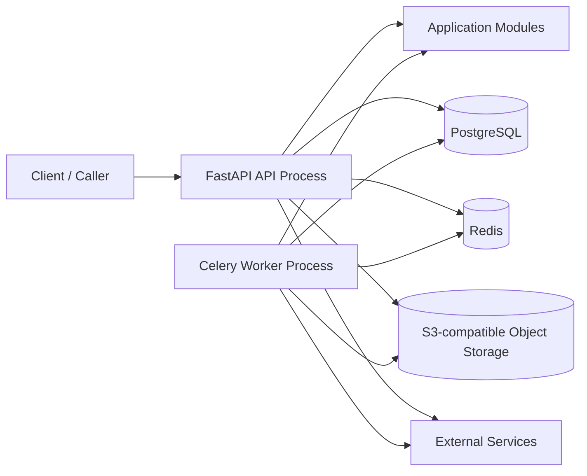

# 基础技术架构文档

- 版本：v1.0
- 文档类型：技术架构基线
- 适用范围：基于模块化单体、工作流编排和可复用能力组件的后端项目
- 更新时间：2026-04-20

---

## 1. 文档目标与适用范围

本文档用于补足“架构基线”之外的**技术实现视角**，定义一个新项目默认采用的基础技术架构。

本文档重点回答以下问题：

1. 项目默认以什么运行形态落地；
2. API、Worker、数据库、缓存、对象存储分别承担什么职责；
3. 数据、异步任务、缓存和文件产物应该分别落在哪一类基础设施中；
4. 配置、环境、部署和最小观测能力如何建立统一基线；
5. 当前默认技术形态与未来演进边界如何衔接。

本文档默认采用如下技术形态：

- 架构形态：模块化单体；
- 运行形态：`API 进程 + Worker 进程`；
- 数据存储：`PostgreSQL`；
- 缓存与轻量异步协调：`Redis`；
- 文件与产物存储：`S3-compatible Object Storage`；
- 应用框架：`FastAPI`；
- 数据访问：`SQLAlchemy 2.x + Alembic`。

本文档不讨论以下内容：

- 具体业务领域规则；
- 云厂商绑定；
- 多区域容灾与复杂高可用拓扑；
- 大规模微服务拆分方案；
- 详细运维 SOP 或发布流水线设计。

与现有文档的关系如下：

- 结构边界、目录职责、依赖方向，以 `docs/architecture_baseline/` 下文档为准；
- 本文档只定义运行时技术基线，不重写业务模块边界。

---

## 2. 技术选型基线

默认技术选型如下：

| 层次 | 默认选型 | 说明 |
| --- | --- | --- |
| 编程语言 | Python 3.12 | 作为项目默认语言版本 |
| Web / API | FastAPI + Uvicorn | 承载 HTTP 接口与应用入口 |
| 数据模型与校验 | Pydantic v2 | 用于请求、响应、配置和 DTO 校验 |
| ORM / 数据访问 | SQLAlchemy 2.x | 承载数据库访问和仓储实现 |
| 数据库迁移 | Alembic | 管理数据库 schema 变更 |
| 关系型数据库 | PostgreSQL | 承载核心持久化数据 |
| 缓存 / 轻量协调 | Redis | 承载缓存、轻量锁、任务队列支撑 |
| 异步任务 | Celery | 承载后台任务和重试任务 |
| 对象存储 | S3-compatible | 承载文件、产物和大对象 |
| 本地运行 | Docker Compose | 本地拉起依赖与多进程环境 |
| 生产交付 | Containerized Deployment | 默认以容器化方式部署 |

### 选型原则

- 默认选择成熟、生态稳定、AI 易于推断和补全的技术栈；
- 优先保证“单体可稳定落地”，而不是过早追求分布式复杂度；
- Redis 与对象存储作为默认预留组件存在，但并不要求所有业务场景一开始就全面使用；
- 业务边界仍通过 `business / capabilities / interfaces / shared / bootstrap` 约束，而不是通过基础设施种类来决定模块归属。

---

## 3. 系统运行时拓扑

默认运行时拓扑如下：

### 运行形态说明

- `API Process` 负责同步请求处理、业务入口调用和异步任务投递；
- `Worker Process` 负责耗时任务、可重试任务、批处理任务和外部 I/O 密集型任务；
- `PostgreSQL` 是默认核心持久化存储；
- `Redis` 用于缓存、轻量协调和异步任务基础支撑；
- `S3-compatible Object Storage` 用于文件和大对象存储；
- 外部系统一律通过业务侧 `infrastructure/` 或 `capabilities/infrastructure/` 对接。

### 与架构基线的对应关系

- `interfaces/http` 主要运行在 `API Process` 中；
- `business` 与 `capabilities` 由 `API Process` 和 `Worker Process` 共同复用；
- `bootstrap` 负责在不同进程中完成依赖装配与实现选择；
- `shared` 为 API、Worker 和能力适配层提供稳定基础设施支持。

---

## 4. 核心组件职责

### 4.1 API 进程

职责：

- 暴露 HTTP API；
- 承担请求解析、鉴权、路由、响应组装；
- 调用 `business` 入口执行同步用例；
- 在需要时投递异步任务给 Worker；
- 暴露健康检查等基础运维接口。

不负责：

- 长时间占用请求线程的后台处理；
- 复杂批处理；
- 将大文件内容直接作为请求链路内存负载长期持有；
- 绕过业务入口直接操作基础设施实现。

### 4.2 Worker 进程

职责：

- 处理耗时或可重试任务；
- 执行文件处理、批量处理、外部服务调用等后台作业；
- 在异步上下文中复用同一套业务模块；
- 承担需要脱离用户请求生命周期的业务步骤。

不负责：

- 替代 API 成为协议入口；
- 持有独立的一套业务边界规则；
- 在任务实现中绕过 `ports + infrastructure` 直接堆叠技术调用。

### 4.3 PostgreSQL

职责：

- 承载业务实体和核心事务性数据；
- 承载持久化的业务状态和工作流执行元数据；
- 作为需要强一致性和可审计记录的默认落点；
- 通过 Alembic 统一管理 schema 演进。

不适合承载：

- 高频短 TTL 缓存数据；
- 分布式锁；
- 大文件和大体积二进制产物；
- 仅用于临时中转的超大任务载荷。

### 4.4 Redis

职责：

- 承载热点缓存；
- 承载轻量级分布式协调能力，例如幂等标记、短 TTL 锁；
- 作为 Celery 的默认 broker / backend 支撑；
- 承载高频但不要求长期持久化的临时数据。

不适合承载：

- 唯一可信的业务主数据；
- 需要长期审计追踪的记录；
- 无上限增长、缺乏 TTL 的大体积对象。

### 4.5 S3-compatible Object Storage

职责：

- 存储上传文件；
- 存储中间产物、导出结果、归档文件；
- 存储不适合进入数据库的大对象内容；
- 为 Worker 和 API 提供统一的文件访问基础设施。

不适合承载：

- 高频事务查询；
- 需要复杂关系约束的结构化业务数据；
- 依赖强事务语义的核心实体状态。

### 4.6 外部系统与三方能力

职责：

- 作为被适配的外部依赖存在；
- 通过 `capabilities` 或业务节点的 `infrastructure/` 统一接入；
- 在边界层完成协议转换、错误归一化、重试和超时策略控制。

约束：

- 外部 SDK 不应在 `service.py` 中直接出现；
- 供应商特有字段不应泄露到业务核心对象中；
- 调用方式从本地切换到远端时，不应要求业务层大规模改写。

---

## 5. 数据与存储基线

### 5.1 数据落位原则

默认按以下原则落位：

- 核心业务数据：进入 PostgreSQL；
- 短生命周期缓存数据：进入 Redis；
- 文件与二进制产物：进入 S3-compatible Object Storage；
- 异步任务消息与轻量协调数据：优先使用 Redis；
- 结构化持久元数据与审计记录：进入 PostgreSQL。

### 5.2 PostgreSQL 使用原则

- 所有核心业务实体应具备明确的数据库持久化模型；
- 数据表结构变更必须通过 Alembic 管理；
- 业务主状态不应只存在于内存、Redis 或任务队列中；
- 当工作流需要恢复、追踪或审计时，其关键执行元数据应有数据库落点。

### 5.3 Redis 使用原则

- 所有缓存条目应具备明确 TTL；
- Redis 中的数据应可在丢失后通过数据库或业务重建；
- 不应将 Redis 作为唯一的业务事实来源；
- 分布式锁和幂等标记应保持粒度清晰、生命周期可控。

### 5.4 对象存储使用原则

- 文件内容、导出文件、图片、附件和大文本产物优先存入对象存储；
- 数据库中保存对象元数据、引用关系和访问标识，而不是直接堆叠大对象内容；
- Worker 处理大文件时，应传递对象引用，而不是在队列中传递大体积二进制数据。

---

## 6. 异步任务与缓存基线

### 6.1 什么场景进入 Worker

以下场景默认应进入 Worker，而不是直接留在请求链路内：

- 明显耗时的外部服务调用；
- 文件解析、批量导出、批量导入；
- 可重试的后台任务；
- 不要求用户同步等待结果的步骤；
- 可能出现波峰波谷、需要削峰的任务。

### 6.2 异步任务设计原则

- 任务消息保持轻量，只传递必要标识和最小上下文；
- 大对象通过数据库记录或对象存储引用回查，不直接塞入队列；
- 任务处理逻辑应具备幂等性；
- 重试策略放在 Worker / infrastructure 层，而不是散落在业务用例中；
- 任务成功与失败都应有明确状态回写策略。

### 6.3 缓存设计原则

- 缓存只加速，不改变业务真相来源；
- 缓存 key 命名应带边界前缀和语义前缀；
- 热点缓存、查询结果缓存和轻量状态缓存应分开治理；
- 当缓存失效策略复杂到开始影响业务正确性时，应回到业务模型重新审视，而不是继续堆补丁。

---

## 7. 配置、环境与部署基线

### 7.1 配置管理

默认采用以下配置原则：

- 使用环境变量承载运行时配置；
- 使用类型化配置对象统一读取和校验；
- 本地、测试、开发、生产环境使用同一套配置模型；
- 密钥、令牌和连接串不得硬编码进业务代码；
- 配置选择和实现切换优先放在 `bootstrap/` 完成。

### 7.2 环境划分

建议至少具备以下环境：

- `local`：本地开发环境；
- `test`：自动化测试环境；
- `dev`：集成开发环境；
- `prod`：生产环境。

### 7.3 本地运行基线

本地默认通过 `Docker Compose` 拉起：

- API 服务；
- Worker 服务；
- PostgreSQL；
- Redis；
- S3-compatible 本地替代实现，例如 MinIO。

如果项目初期尚未使用 Redis 或对象存储，也建议在本地基线中为其保留配置位和容器位，避免后续引入时破坏整体运行结构。

### 7.4 生产部署基线

生产环境默认采用容器化部署，最小形态通常包括：

- 一个 API Deployment / Service；
- 一个 Worker Deployment；
- 一个 PostgreSQL 实例或托管数据库；
- 一个 Redis 实例或托管缓存；
- 一个对象存储服务或云存储桶。

本文档不强绑定 Kubernetes、ECS 或其他具体平台，但要求部署形态满足：

- API 与 Worker 可独立扩缩；
- 数据库迁移可独立执行；
- 配置与密钥可安全注入；
- 基础依赖可进行健康检查和启动顺序管理。

### 7.5 最小观测与运维基线

基础技术架构至少应提供以下能力：

- 结构化日志；
- 请求 ID / 任务 ID 贯穿日志链路；
- API 健康检查接口；
- Worker 存活与队列积压可观测；
- 关键外部依赖调用具备超时、错误日志和失败定位信息。

这部分只定义最低基线，不展开完整监控、告警和追踪平台建设方案。

---

## 8. 演进边界与非目标

### 8.1 当前默认形态

当前默认形态是：

- 一个代码仓库；
- 一套清晰的模块边界；
- API 与 Worker 共享同一套业务模块；
- PostgreSQL 作为核心持久化；
- Redis 和对象存储作为默认预留基础设施。

### 8.2 允许的自然演进方向

后续允许沿以下方向演进，而不破坏当前基线：

- 将某些耗时任务从单 Worker 扩展为多 Worker 队列；
- 将某个 `capability` 从本地模块替换为远程服务；
- 将对象存储用量从少量文件扩展到正式产物仓库；
- 将 Redis 从纯缓存用途扩展到更丰富的异步协作用途。

### 8.3 当前非目标

以下内容不是当前基础技术架构的默认目标：

- 一开始就拆成多服务或微服务；
- 一开始就引入 Kafka、服务网格或复杂事件平台；
- 一开始就设计多区域多活；
- 为所有模块引入复杂分布式事务方案；
- 把技术复杂度前置到超出项目初期交付需要。

### 8.4 一句话总结

这份基础技术架构的核心主张是：

> 先用模块化单体稳定落地，以 PostgreSQL 作为核心事实来源，以 Redis 和对象存储作为默认预留基础设施，通过 API + Worker 形态支撑同步请求与异步处理，并为未来拆分能力服务保留演进空间。
